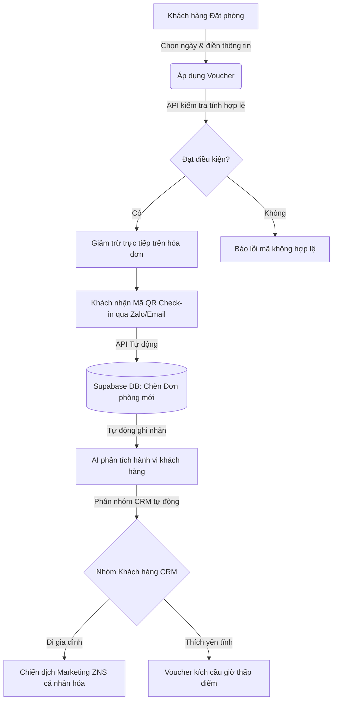
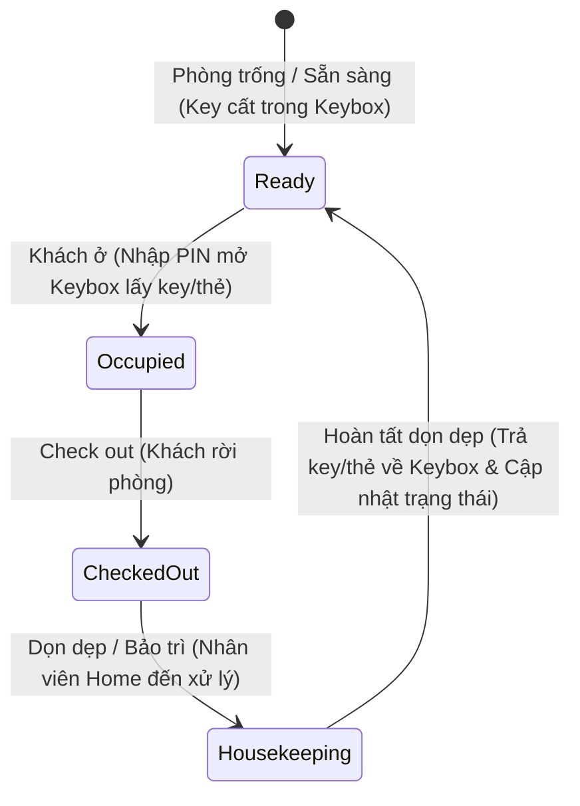

# 🏡 TỔNG QUAN HỆ THỐNG DANCIN HOME BOOKING & ADMIN PORTAL

Hệ thống quản lý đặt phòng và chăm sóc khách hàng tự động **Dancin Home** là một giải pháp chuyển đổi số toàn diện cho chuỗi Homestay cao cấp. Hệ thống được chia làm hai phân hệ cốt lõi: **Ứng dụng Đặt phòng Khách hàng (Client Booking)** và **Cổng Quản trị Doanh nghiệp (Admin Portal)**. 

Hệ thống sử dụng bảng màu thương hiệu **Navy Thượng Hạng (`#0A273A`)** kết hợp với sắc xanh ngọc và nền đá sáng sang trọng, tạo cảm giác vintage cổ điển nhưng vô cùng hiện đại và cao đẳng.

---

## 🎨 1. BỐ CỤC & GIAO DIỆN (LAYOUT & UI/UX)

### A. Phân Hệ Đặt Phòng Khách Hàng (Client Booking Page - `/`)
Giao diện đặt phòng hướng tới trải nghiệm tối giản, nhanh chóng và giàu cảm xúc trên thiết bị di động cũng như máy tính:
* **Khung Nhìn Trực Quan (Interactive Room Gallery):** Hiển thị danh sách các phòng bungalow gỗ dưới dạng thẻ ảnh trượt kèm chi tiết tiện ích.
* **Biểu Mẫu Đặt Phòng Thông Minh (Compact Booking Form):**
  * Tích hợp lịch chọn ngày check-in/check-out trực quan, tự động tính tổng số đêm ở.
  * Form nhập liệu tối giản: Họ tên, Số điện thoại, Email và Ghi chú đặc biệt.
  * Ô nhập mã **Voucher khuyến mãi** tự động kiểm tra tính hợp lệ và hiển thị số tiền được chiết khấu trực tiếp trên hóa đơn tạm tính.
* **Mã QR Check-In Tự Động:** Hệ thống tạo mã QR check-in độc nhất và an toàn gửi trực tiếp cho khách hàng sau khi booking thành công, giúp rút ngắn tối đa thời gian làm thủ tục tại quầy.

### B. Cổng Quản Trị Hệ Thống (Admin Portal - `/admin`)
Cấu trúc bố cục được thiết kế theo chuẩn **SaaS Enterprise** đem lại hiệu suất vận hành cao nhất:
* **Khung Cố Định Tuyệt Đối (100% Frozen layout):**
  * **Frozen Column (Cột Menu trái):** Sidebar cố định chiều cao, chứa Logo Dancin Home nổi bật, danh sách Menu chính điều hướng nhanh và nhóm **Cài đặt + Đăng xuất** được ghim cứng cố định dưới đáy màn hình. Hỗ trợ thu gọn (collapsed mode) tinh tế.
  * **Frozen Row (Dòng Header trên):** Cố định tiêu đề phân hệ, nút kích hoạt trợ lý ảo **Dancin Copilot 🤖** và thông tin Quản trị viên thử nghiệm.
  * **Scrollable Content (Khung nội dung chính):** Chỉ riêng vùng làm việc ở giữa là cuộn lên xuống mượt mà dưới Header và bên cạnh Sidebar. Không bao giờ xảy ra lỗi trôi hay khuất tầm nhìn menu.

---

## ⚡ 2. CÁC TÍNH NĂNG NỔI BẬT (FEATURES)

### 📊 A. Dashboard Báo Cáo & Phân Tích Dữ Liệu (`/admin/dashboard`)
Hệ thống biểu đồ được vẽ bằng **công nghệ hình học SVG thuần** tương tác cao, mượt mà và tương thích tuyệt đối với Next.js 16/React 19:
* **Xu hướng Đơn & Loại Khách (Line & Area Chart):** Biểu diễn sự biến động lượng booking song song với số lượng khách hàng mới và khách quay lại theo thời gian.
* **Hiệu suất Voucher (Multi-Series Bar Chart):** Cột kép so sánh tỷ lệ phát hành voucher so với lượng voucher thực tế được khách hàng áp dụng.
* **Cơ cấu Doanh Thu CRM (Donut Chart & breakdown):** Hiển thị trực quan tỷ lệ % doanh thu đóng góp của các nhóm đối tượng hành vi.
* **Bảng Xếp Hạng Phòng/Chi Nhánh:** Liệt kê doanh số thực tế và tỷ lệ lấp đầy phòng (làm nổi bật phòng gỗ CS3 Quận 5 hoạt động xuất sắc >90% và phòng kính CS4 Gò Vấp cần cải thiện).
* **Hiệu quả Tiếp Thị (Horizontal Stacked Bar):** Phân tích chỉ số CTR (Click-Through Rate) của các chiến dịch Marketing, tự động gắn nhãn: *Thành công vượt trội 🚀 (>30%)*, *Hoạt động hiệu quả ✅ (15-30%)*, *Cần tối ưu ⚠️ (<15%)*.

### 🤫 B. Trợ Lý Phân Tích Chiến Lược Dancin Copilot AI
* Tích hợp trực tiếp tại cuối trang Dashboard. Khi nhấn nút **"Phân Tích Dữ Liệu Bằng AI"**, trợ lý ảo sẽ tự động "đọc hiểu" các chỉ số thống kê trên đồ thị và xuất ra báo cáo Markdown phân tích chuyên sâu.
* Cung cấp các **đề xuất Kế hoạch Sales & Marketing thực tế** (cải tạo rèm che phòng kính Gò Vấp lấp đầy giờ trưa; nhân rộng combo BBQ gỗ CS3 sang Tân Bình; dừng chiến dịch Email CTR kém để dồn ngân sách Zalo ZNS sinh nhật).

### 👥 C. CRM & Nhóm Khách Hàng sheets (`/admin/customers`)
* **Hồ Sơ Chi Tiết Click-to-View:** Họ tên khách hàng ở mọi bảng đều có thể bấm vào để trượt mở modal chi tiết: Xem doanh thu tích lũy, số đơn đặt phòng, ghi chú lễ tân và toàn bộ lịch sử booking.
* ** CRM Sheets Layout:** Trình bày danh sách nhóm khách hàng theo dạng thẻ ngang (Sheet tab). Khi click vào Nhóm 1, danh sách khách hàng thuộc nhóm này sẽ hiện ra và các nhóm khác sẽ ẩn đi, hệt như trong Google Sheets.
* **Liên kết marketing tức thì:** Tích hợp nút **"📢 Tạo Chiến Dịch"** tại thanh tiêu đề mỗi nhóm để thiết lập nhanh chiến dịch gửi Zalo ZNS/Email cho nhóm đó:
  * Dropdown tự động nạp các mã Voucher đang kích hoạt từ database.
  * Preview mô phỏng tin nhắn Zalo hiển thị trên giao diện điện thoại thông minh, biên dịch trực tiếp các biến động `{ten_khach}` và `{ma_voucher}` sang nội dung thực tế trước khi lưu bản nháp (`draft`) vào Supabase.

### 🛏️ D. Các Phân Hệ Quản Trị Cốt Lõi Khác
* **Quản lý Đơn Booking (`/admin/bookings`):** Lưới danh sách đơn đặt lịch trực quan, bộ lọc trạng thái thanh toán (Đã cọc, Chờ thanh toán, Hủy phòng).
* **Quản lý Phòng (`/admin/rooms`):** Thiết lập giá phòng, mô tả phòng cabin gỗ, upload gallery ảnh, điều chỉnh chi nhánh.
* **Quản lý Voucher (`/admin/vouchers`):** Tạo mới mã giảm giá, giới hạn ngân sách phát hành, cài đặt ngày bắt đầu và kết thúc chương trình.
* **Hạng Thành Viên (`/admin/memberships`):** Cấu hình tiêu chí chi tiêu tích lũy để thăng hạng VIP (Diamond 💎, Gold 🥇, Silver 🥈, Bronze 🥉) và các đặc quyền đi kèm.
* **Tích Hợp Hệ Thống (`/admin/integrations`):** Cài đặt cấu hình API quét mã QR check-in, cấu hình kênh Zalo ZNS và hệ thống gửi thư điện tử Email tự động.

---

## 🔄 3. LOGIC & WORKFLOW VẬN HÀNH

Hệ thống hoạt động dựa trên các chuỗi logic khép kín tự động hóa, liên kết chặt chẽ giữa Cơ sở dữ liệu **Supabase (PostgreSQL)** và giao diện điều khiển:

### A. Vòng Đời Đặt Phòng & Đồng Bộ Dữ Liệu
1. Khách hàng thực hiện book phòng trên cổng ngoài `app/(booking)/page.tsx`.
2. Hệ thống kiểm tra điều kiện Voucher và ngày trống phòng thực tế thông qua các API endpoint.
3. Khi đặt phòng hoàn tất, dữ liệu được đồng bộ ngay lập tức vào bảng `bookings` trong Supabase.
4. Lịch sử chi tiêu và số đơn đặt phòng tự động cộng dồn vào hồ sơ khách hàng (`customers`).

### B. Logic Phân Nhóm CRM Bằng AI (AI CRM Segmentation)
* Khi khách hàng hoàn thành lưu trú, hành vi của họ (số người đi cùng, nhu cầu nướng BBQ, xu hướng đặt phòng biệt lập yên tĩnh) sẽ được AI ghi nhận.
* Hệ thống tự động phân loại khách hàng vào các nhóm CRM thông minh như *"Đi gia đình 🏡"*, *"Thích yên tĩnh 🤫"*, *"Thuê ngắn giờ ⚡"*.

### C. Luồng Marketing Gửi Voucher Động (ZNS Campaign Pipeline)
* Quản trị viên truy cập tab Nhóm Khách Hàng CRM, chọn nhóm *"Thích yên tĩnh"* và nhấp *"Tạo Chiến Dịch"*.
* Chọn mã voucher kích cầu `GIAM15`. Hệ thống tự động tạo mẫu tin nhắn Zalo gửi chúc mừng đính kèm voucher này.
* Nhấp xác nhận, dữ liệu được ghi nhận vào bảng `campaigns` để hệ thống tự động đẩy tin nhắn qua API Zalo ZNS tới đúng số điện thoại của từng khách hàng trong nhóm.

### D. Chu trình Vận hành Trạng thái Phòng & Dọn dẹp/Bảo trì (Room Operational Lifecycle)
Hệ thống Dancin Home tuân thủ nghiêm ngặt quy trình vận hành phòng khép kín để đảm bảo an toàn tuyệt đối và tính sẵn sàng của cơ sở vật chất trước khi đón lượt khách mới:

1. **Phòng trống / Sẵn sàng (`ready`):** Phòng đã dọn sạch sẽ, thẻ từ/chìa khóa đã được cất trả lại đúng vị trí trong Hộp khóa thông minh (Smart Keybox). Chỉ khi ở trạng thái này, hệ thống mới cho phép mở check-in cho khách mới.
2. **Khách ở (`occupied`):** Khách đã check-in thành công, lấy thẻ/chìa khóa và đang lưu trú trong phòng.
3. **Khách Check out (`dirty`):** Khách hoàn tất thời gian lưu trú và rời đi. Hệ thống tự động chuyển trạng thái phòng sang `Chờ dọn dẹp` để ngăn chặn việc khách tiếp theo tự động check-in sớm khi phòng chưa được làm sạch.
4. **Dọn dẹp / Bảo trì (`housekeeping`):** Nhân viên dọn dẹp hoặc nhân sự bảo trì của Dancin Home đến phòng để xử lý vệ sinh, kiểm tra kỹ thuật. 
5. **Trả thẻ & Trả phòng trống:** Khi và chỉ khi nhân viên hoàn tất 100% công việc dọn dẹp/bảo trì, **cất lại thẻ từ/chìa khóa vật lý vào Hộp khóa (Keybox)** và nhấn nút xác nhận *"Hoàn tất dọn dẹp & Cất khóa"* trên Admin Portal, trạng thái phòng mới được chuyển về **`Phòng trống / Sẵn sàng` (Ready)**. Lúc này, mã PIN Keybox mới cho khách tiếp theo mới chính thức được kích hoạt và cấp phép hiển thị.

---

## 🎁 4. GIÁ TRỊ NHẬN ĐƯỢC KHI SỬ DỤNG HỆ THỐNG

### 👥 A. Đối Với Khách Lưu Trú (Guests)
* **Trải nghiệm mượt mà:** Quy trình đặt phòng chỉ mất 3 bước đơn giản dưới 30 giây, nhận ngay Mã QR Check-in tự động giúp làm thủ tục nhận phòng tức thì tại quầy.
* **Lợi ích cá nhân hóa:** Nhận được các chương trình ưu đãi, mã giảm giá gửi trực tiếp qua Zalo đúng với nhu cầu thực tế của mình (ví dụ: gia đình nhận ưu đãi BBQ cuối tuần, khách công tác nhận voucher giảm giờ nghỉ trưa).
* **Hạng thành viên công bằng:** Điểm chi tiêu tích lũy tự động nâng hạng VIP giúp khách hàng được giảm giá trực tiếp cho những lần đặt phòng tiếp theo.

### 👑 B. Đối Với Nhà Quản Lý / Chủ Doanh Nghiệp (Admins & Owners)
* **Tối đa hóa doanh thu & Công suất phòng:** 
  * Phát hiện kịp thời các chi nhánh đang trống lịch hoặc làm việc chưa hiệu quả (như phòng kính CS4) thông qua Dashboard báo cáo để lên phương án flash sale lấp phòng trống.
  * Tận dụng triệt để sức mạnh chăm sóc khách hàng cũ (lượng khách quay lại đạt tỉ lệ cao) giúp tiết kiệm đến 30% chi phí marketing tìm khách mới.
* **Tự động hóa 90% quy trình Marketing:**
  * Không cần nhân sự thiết lập email/Zalo thủ công rườm rà. Hệ thống tự kết nối các mã Voucher vào các chiến dịch tiếp thị nhóm chỉ bằng vài click.
  * Quản trị và kiểm duyệt nội dung tin nhắn gửi đi cực kỳ trực quan với màn hình smartphone live preview.
* **Quyết định kinh doanh thông minh nhờ AI:**
  * Trợ lý ảo **Dancin Copilot AI** đồng hành 24/7 như một chuyên gia tư vấn chiến lược tại chỗ, đưa ra các sales/marketing plan cụ thể cho từng tuần/tháng/quý mà không tốn chi phí thuê ngoài.
* **Vận hành chuyên nghiệp & Nhàn nhã:** Giao diện Frozen Layout giúp lễ tân, quản lý vận hành kiểm soát tất cả hoạt động đặt phòng, hồ sơ khách hàng, và hiệu năng doanh số một cách tập trung, nhanh chóng và không bao giờ bị gián đoạn.
